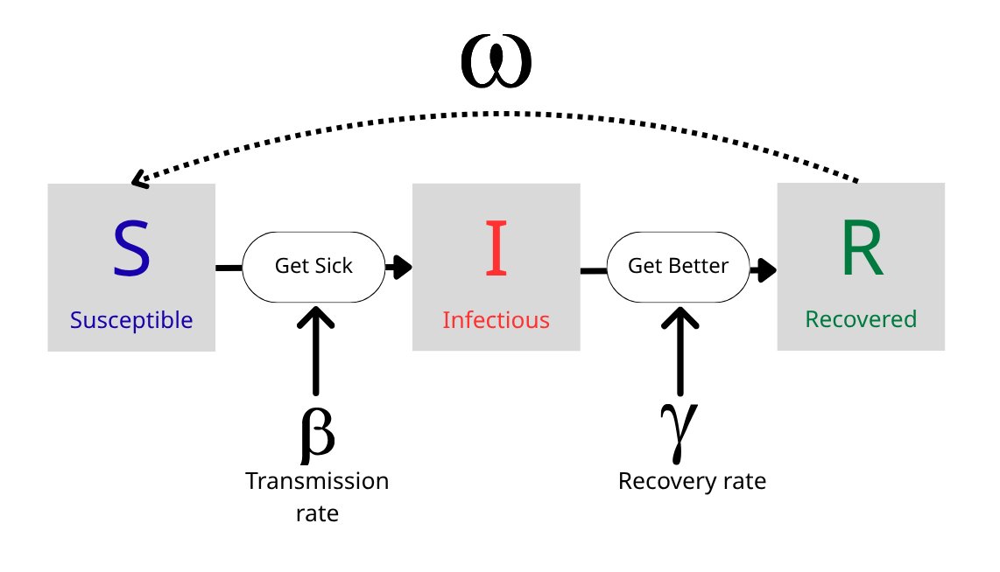
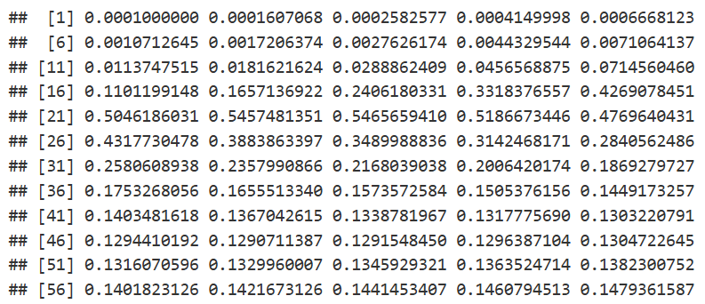
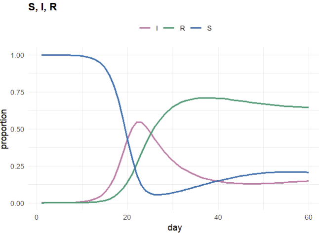
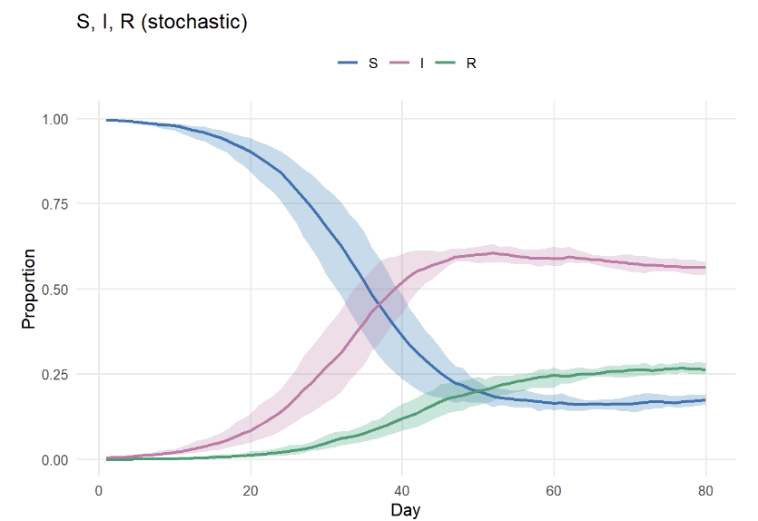
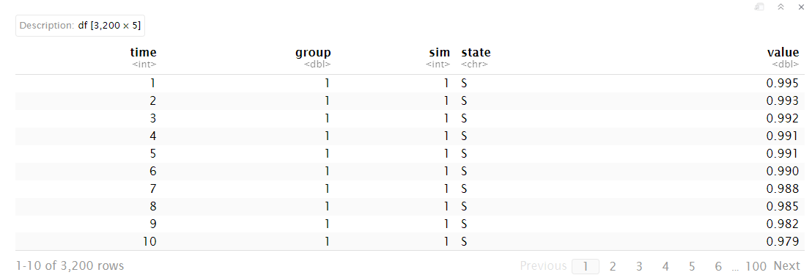

# SIRS Modeling Simulator

Fast, clear, and reproducible SIRS simulations for deterministic and stochastic scenarios—supporting multi-population runs and tidy summary tables—with an optional, self-arranging dashboard for exploration and further analysis.

## What is SIRS model?

The SIRS model is a type of mathematical model used in epidemiology to describe the dynamics of an infectious disease in a population by dividing it into three compartments: **Susceptible**, **Infectious**, and **Recovered**.<br>

**Susceptible(S)** means who have no immunity from the disease.<br>

**Infectious(I)** means who have the disease and can spread it to susceptibles.<br>

**Recovered (R)** means who have recovered from the disease and are immune.



A simple continuous-time form is:

$$\begin{aligned}
\frac{dS}{dt} &= -\beta SI + \omega R\\
\frac{dI}{dt} &=  \beta SI - \gamma I\\
\frac{dR}{dt} &=  \gamma I - \omega R\\
\end{aligned}$$

Where: <br>
$\beta(t)$ is the transmission rate.<br>
$\gamma$ is recovery rate.<br>
$\omega$ rate at which the immune in R becomes susceptible again.(R → S)<br>
$N = S + I + R$ is the total population size.

## Why do we need `epi-simulation`?

Covid-19 pandemic has highlighted the importance of epidemiological modeling in understanding and controlling infectious diseases. 
The SIRS model is a fundamental tool in this field, but implementing it can be complex and time-consuming. 
The `epi-simulation` package aims to simplify this process by providing a user-friendly interface for simulating SIRS models, 
allowing researchers and public health officials to quickly generate insights and inform decision-making.

# Installation

The development version of epi-simulation can be installed from [GitHub](https://github.com/idem-lab/epi-simulation/tree/main).<br>

First, download the package source code from GitHub.<br>

* Option A - Download ZIP

  - Click Code ▸ Download ZIP, then unzip locally.
  
* Option B - Clone via Terminal
  - Open your RStudio and paste the following into Terminal.

```{r}
git clone https://github.com/idem-lab/epi-simulation.git
cd epi-simulation
```
Then Open the `epi-simulation.Rproj` file to load the project in RStudio.<br>

Next, load the functions in R:

```{r}
# Load the functions
R.utils::sourceDirectory("R/")
```
We haven’t released this as a formal R package yet; please source the R files directly. Sorry for the inconvenience caused.

# What's inside?

| Category | Function(s) | Description |
|------------------|---------------------|---------------------------------|
| **Simulators** | `simulate_sirs_det()` | Deterministic single population. |
|  | `simulate_sirs_stoch()` | Stochastic single population (many rounds). |
|  | `simulate_sirs_multi()` | Deterministic multi-population. |
|  | `simulate_sirs_multi_stoch()` | Stochastic multi-population. |
| **Plotting** | `plot_sirs()` | Single-pop SIR/overlay/incidence views. |
|  | `plot_stoch()` | Stochastic ribbons/lines & incidence. |
|  | `plot_multi()` | Multi-pop S/I/R/incidence (combined or faceted). |
|  | `plot_dashboard()` + `arrange_dashboard()` | Build a multi-panel dashboard. |
|  | `plot_det_vs_stoch()` | Compare deterministic vs stochastic. |
| **Summaries & helpers** | `summarize_sim()` | Headline outbreak metrics (peaks, final R, etc.). |
|  | `make_beta()` | Create time-varying beta (constant, seasonal). |
|  | `adjust_beta()` | Scale beta within specified day windows. |
|  | `to_tidy()` | Coerce outputs to a tidy long table (time, group, sim, state, value). |
|  | `cumulative_incidence()` | Cumulative incidence over time. |
|  | `sanity_check()` | Verify S + I + R ≈ 1 at each time step. |
|  | `attack_rate()` |Cumulative attack rate over the simulation horizon. |
|  | `check_contact()` | Quick diagnostics for contact matrices. |
|  | `reff_from_sim()` | Effective reproduction metric from simulated paths. |

# Example

Here are some examples of how to use the package functions.<br>

For full example please check the `User-Demo.Rmd` it is user-friendly walkthroughs.<br>

Deterministic single-population SIRS simulation:

```{r}
n_times <- 60     # Total days to simulate
pop <- 100000     # Total population
I_init <- 10      # Initial number of infectious individuals
beta <- 0.75      # Transmission rate
gamma <- 1/7      # Recovery rate
omega <- 1/30     # Rate of loss of immunity(R -> S)

sim_1 <- simulate_sirs_det(n_times, pop, I_init, beta, gamma, omega)
sim_1$I
```



```{r}
# plot options: "overlay", "sir", "incidence", "both_side"
plotA <- plot_sirs(sim_1, which = "sir")

# If you want to save the plot, please use ggsave()
# ggsave(plotA, filename = "deterministic_constant_beta.png", width = 8, height = 5)
```



Stochastic single-population SIRS simulation with multiple runs:

```{r}
# Stochastic
n_sims   <- 200   # Number of independent simulation runs (columns).
epsilon  <- 0     # External infection pressure.
alpha    <- 0.1   # Reporting rate
seed     <- 42    # Random seed for reproducibility

# Customise uncertainty ribbons(Default to 95%)
ribbon_probs<- c(0.025, 0.975)

stoch_D <- simulate_sirs_stoch(
  n_times = 80, pop = 1000, I_init = 5,
  beta = 0.2, gamma = 1/30, omega = 1/14,
  epsilon = epsilon, alpha = alpha,
  n_sims = n_sims, stochastic = TRUE, seed = seed
)
stoch_D$params$ribbon_probs <- ribbon_probs

# plot options: "overlay", "SIR", "incidence", "both"
plot_stoch(stoch_D, which = "SIR")
```


Tidy output for downstream analysis:

Stochastic model will return a long list so we can use `to_tidy()` to convert it to a tidy data frame table for further analysis:<br>
* **Time:** simulation date.<br>
* **Group:** populations size.<br>
* **Sim:** independent simulation runs.<br>
* **State:** S, I, R compartments.<br>
* **Value:** the number of individuals in each compartment at each time point for each simulation run.

```{r}
to_tidy(stoch_D)
```


For more other examples, please check the `User-Demo.Rmd` file in the repository.

# Reproducing the Figures
We ensure reproducibility by setting seeds and providing a one-step rebuild:<br>
- running `scripts/make_plots.R` will run all scenarios,<br>
- source the code in `R/`, <br>
- and regenerate every figure (`det_sir.png`, `det_incidence.png`,etc.) into the `plots/` folder.


## Notes

* Active development in progress—README plots will render correctly in the packaged version.

* When the package is created the installation way will change into the following:

```{r}
# If you don't have devtools installed yet
install.packages("devtools")

devtools::install_github("idem-lab/epi-simulation")

# Load the package
library(epi-Simulation)
```
Once we turn into a package, we will update this README file accordingly.<br>

If there any questions please do not hesitate to open an issue on GitHub. Thank you!
